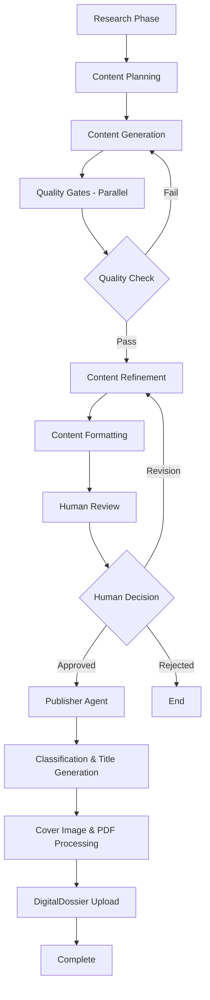

# ContentRunway - AI Content Pipeline

## Project Overview
ContentRunway is a quality-first AI content creation system that uses LangGraph to orchestrate sophisticated multi-agent workflows for producing high-quality, domain-specific content in IT/Insurance/AI domains with automated publishing to DigitalDossier.us.

**Phase 1**: Single-tenant personal use (no multi-tenant features)
**Focus**: Quality over speed with 85%+ quality thresholds
**Publishing**: Automated DigitalDossier integration with PDF generation and cover image processing

## Technology Stack

### Backend
- **FastAPI** - Python REST API
- **LangGraph** - Agent orchestration with StateGraph
- **PostgreSQL** - Structured data with RLS
- **Milvus** - Vector database for knowledge base
- **Redis** - Caching and session management

### Frontend
- **Next.js 14** - App Router with TypeScript
- **Tailwind CSS** - Styling
- **Zustand** - Global state management
- **TanStack Query** - Server state management
- **Monaco Editor** - Content editing
- **Socket.io** - Real-time updates

### Infrastructure
- **Docker** - Containerization with hot reloading
- **Docker Compose** - Development environment
- **PostgreSQL 16** - Database with local volumes
- **Nginx** - Reverse proxy

## Development Commands

### Setup
```bash
# Start development environment
docker-compose up -d

# Hot reload frontend
npm run dev

# Run backend with hot reload
uvicorn main:app --reload --host 0.0.0.0 --port 8000
```

### Testing
```bash
# Frontend tests
npm test

# Backend tests
pytest

# Type checking
npm run type-check
mypy .
```

### Quality Checks
```bash
# Lint frontend
npm run lint

# Lint backend
ruff check .
black .

# Format code
prettier --write .
```

## Agentic Workflow Orchestration

ContentRunway uses LangGraph to orchestrate a sophisticated multi-agent pipeline with 15+ specialized agents working in coordinated phases:

### Phase 1: Research & Intelligence Gathering
**ResearchCoordinatorAgent** - Master coordinator for research operations
- Orchestrates domain-specific research across multiple sources
- Coordinates with specialized research agents
- Manages research quality and coverage validation

### Phase 2: Content Planning & Strategy
**ContentCuratorAgent** - Content strategy and outline development
- Analyzes research findings and identifies key themes
- Creates comprehensive content outlines
- Ensures content alignment with domain expertise

**SEOStrategistAgent** - SEO optimization and keyword strategy
- Performs keyword research and competitive analysis
- Develops SEO-optimized content structure
- Plans meta descriptions and title strategies

### Phase 3: Content Generation
**ContentWriterAgent** - Primary content creation
- Generates high-quality, domain-specific content
- Incorporates research findings and citations
- Maintains consistent voice and style

### Phase 4: Quality Assurance (Parallel Validation)
**Parallel Quality Gates** - 4 specialized validation agents running concurrently:

1. **FactCheckGateAgent** - Technical accuracy validation (90%+ threshold)
   - Verifies facts, statistics, and technical claims
   - Cross-references citations and sources
   - Validates domain-specific technical information

2. **DomainExpertiseGateAgent** - Domain expertise verification (90%+ threshold)
   - Ensures content meets industry standards
   - Validates technical depth and accuracy
   - Checks for domain-specific best practices

3. **StyleCriticGateAgent** - Style consistency checking (88%+ threshold)
   - Maintains brand voice and tone consistency
   - Ensures readability and engagement
   - Validates formatting and structure

4. **ComplianceGateAgent** - Compliance validation (95%+ threshold)
   - Ensures regulatory compliance
   - Checks for legal and ethical considerations
   - Validates industry-specific requirements

### Phase 5: Content Refinement
**ContentEditorAgent** - Content editing and improvement
- Refines content based on quality gate feedback
- Enhances readability and flow
- Optimizes content structure and presentation

**CritiqueAgent** - Final content validation
- Performs comprehensive content review
- Ensures all quality thresholds are met
- Makes final improvement recommendations

### Phase 6: Content Formatting
**ContentFormatterAgent** - Multi-platform formatting
- Creates platform-specific content versions
- Optimizes formatting for different channels
- Prepares content for publishing workflow

### Phase 7: Human Review Gateway
**HumanReviewGateAgent** - 15-minute human approval interface
- Presents content for human review
- Manages approval/revision workflows
- Handles human feedback integration

### Phase 8: Automated Publishing (DigitalDossier Integration)
**PublisherAgent** - Master publishing orchestrator with 3 specialized sub-agents:

#### Sub-Agent 1: Content Intelligence
**CategoryClassifierAgent** - AI-powered content classification
- Uses OpenAI GPT-4 for Blog vs Product categorization
- Analyzes content domain (IT Insurance, AI Research, Agentic AI)
- Provides confidence scoring and key indicator extraction

**TitleGeneratorAgent** - Optimized title generation
- Generates 4 title variants using GPT-4
- Performs SEO optimization and engagement scoring
- Selects best title with detailed reasoning

#### Sub-Agent 2: Visual Asset Management  
**CoverImageAgent** - Intelligent cover image processing
- Category-based image selection from local directories
- Computer vision-based text removal from images
- Fallback handling with placeholder generation

#### Sub-Agent 3: Document & Publishing Tools
**PDFGeneratorTool** - Professional PDF creation
- ReportLab-based PDF generation with formatting
- Author attribution and title page generation
- Markdown/HTML to PDF conversion

**DigitalDossierAPITool** - API integration and upload
- Complete DigitalDossier.us API integration
- Document upload with comprehensive error handling
- Genre mapping and batch operations support

**GenreMappingTool** - Intelligent content categorization
- Semantic analysis for genre matching
- Genre caching for performance optimization
- New genre suggestion capabilities

### Quality Thresholds (Enforced at Every Gate)
- Technical accuracy validation: **90%+ threshold**
- Domain expertise verification: **90%+ threshold**  
- Style consistency checking: **88%+ threshold**
- Compliance validation: **95%+ threshold**
- **Overall quality minimum: 85%+**

### Workflow Orchestration Features
- **Parallel Processing**: Quality gates run concurrently for efficiency
- **Conditional Routing**: Smart routing based on quality scores
- **Error Recovery**: Automatic retry mechanisms with fallback strategies
- **State Management**: Comprehensive pipeline state tracking
- **Checkpoint System**: SQLite-based checkpointing for reliability

## Project Structure

```
ContentRunway/
├── backend/                 # FastAPI application
├── frontend/               # Next.js application
├── langgraph/              # LangGraph agents and workflows
│   └── contentrunway/
│       ├── agents/         # Main pipeline agents
│       │   ├── research.py         # ResearchCoordinatorAgent
│       │   ├── curation.py         # ContentCuratorAgent  
│       │   ├── seo.py              # SEOStrategistAgent
│       │   ├── writing.py          # ContentWriterAgent
│       │   ├── quality_gates.py    # Quality validation agents
│       │   ├── editing.py          # ContentEditorAgent
│       │   ├── critique.py         # CritiqueAgent
│       │   ├── formatting.py       # ContentFormatterAgent
│       │   ├── human_review.py     # HumanReviewGateAgent
│       │   ├── publisher.py        # PublisherAgent (DigitalDossier)
│       │   ├── category_classifier_agent.py  # Content classification
│       │   ├── title_generator_agent.py      # Title optimization
│       │   └── cover_image_agent.py          # Image processing
│       ├── tools/          # Specialized tools
│       │   ├── digitaldossier_api_tool.py    # API integration
│       │   ├── pdf_generator_tool.py         # PDF creation
│       │   ├── cover_image_processor_tool.py # Image processing
│       │   ├── content_classification_tool.py # AI classification
│       │   └── genre_mapping_tool.py         # Genre intelligence
│       ├── utils/          # Utilities
│       │   └── publisher_logger.py           # Comprehensive logging
│       ├── state/          # Pipeline state management
│       └── pipeline.py     # Main LangGraph orchestrator
├── docs/
│   ├── cover-image/        # Cover image assets
│   │   ├── blog/          # Blog category images
│   │   └── product/       # Product category images
│   └── *.md               # Documentation
├── docker-compose.yml      # Development environment
├── Dockerfile.backend      # Backend container with hot reload
├── Dockerfile.frontend     # Frontend container with hot reload
└── requirements-publisher.txt # Additional publisher dependencies
```

## Docker Development

All services run in Docker with:
- Hot reloading enabled for development
- Database volumes mounted locally for persistence
- Environment variables for API keys and configuration
- Health checks and service dependencies

## LLM Integration

### Supported Providers
- **OpenAI** (GPT-4, GPT-4-turbo, GPT-4o-mini) - Primary content generation
- **Google AI** (Gemini Pro, Gemini Flash) - Research and analysis
- **Anthropic** (Claude Sonnet, Claude Haiku) - Long-form analysis and safety

### Usage Patterns
- Quality-first model selection
- Cost optimization through intelligent model routing
- Multi-provider research for diverse perspectives
- Redis caching for repeated operations

## Content Domains

### Specialized Research Agents
- **IT Insurance** - Regulatory compliance, digital transformation, insurtech
- **AI Research** - Technical AI content, ML developments, LLM integrations  
- **Agentic AI** - Multi-agent systems, LangGraph, agent orchestration

### Publishing Integration
- **DigitalDossier.us**: Automated PDF publishing with cover images
- **Content Classification**: AI-powered Blog vs Product categorization  
- **Genre Mapping**: Intelligent content-to-genre matching
- **Visual Processing**: Automated cover image selection and text removal

## Environment Configuration

### Required Environment Variables

#### DigitalDossier API Configuration
```bash
DIGITALDOSSIER_API_TOKEN=your_api_token_here
DIGITALDOSSIER_BASE_URL=http://localhost:3003  # Test environment
DIGITALDOSSIER_ADMIN_EMAIL=your_admin_email
DIGITALDOSSIER_ADMIN_PASSWORD=your_admin_password
```

#### AI/LLM Configuration
```bash
OPENAI_API_KEY=your_openai_key
GOOGLE_AI_API_KEY=your_google_ai_key  # Optional
ANTHROPIC_API_KEY=your_anthropic_key  # Optional
```

#### Optional Configuration
```bash
PUBLISHER_LOG_LEVEL=INFO
PUBLISHER_LOG_DIR=./logs/publisher/
ENCRYPTION_KEY=generate_with_openssl_rand_hex_32
```

### Additional Dependencies Installation
```bash
# Install additional publisher dependencies
pip install -r langgraph/requirements-publisher.txt

# OR using uv (recommended)
uv add -r langgraph/requirements-publisher.txt
```

## Agent Orchestration Flow



## Development Notes

- Build dockerized solution with hot reloading
- Mount database volumes locally for persistence  
- Single-tenant implementation (Phase 1)
- Quality thresholds enforced at every gate (85%+ overall)
- 15-minute human review workflow
- Comprehensive logging and monitoring across all agents
- Multi-agent parallel processing for efficiency
- Automated DigitalDossier publishing with AI-powered enhancements
- Make sure to use uv to manage all dependencies

# Git Commit Preferences
- DO NOT include any Claude or AI attribution in commit messages
- DO NOT add "Generated with Claude Code" or "Co-Authored-By: Claude" lines
- Use clean, professional commit messages without AI references