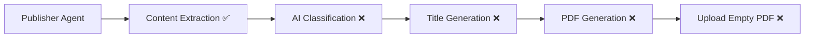

# ContentRunway Pipeline Debugging Analysis

**Date:** October 1, 2025  
**Issue:** Pipeline uploads test samples instead of real generated content  
**Status:** Root Cause Identified - PDF Generation Failure  

## Problem Statement

The ContentRunway pipeline reaches 98% completion and reports success, but uploads a placeholder/test document to DigitalDossier instead of the actual generated content about the requested topic (e.g., "AI in Insurance").

## Investigation Process

### Initial Hypothesis
Initially suspected content extraction failure in the PublisherAgent where the pipeline was falling back to empty/placeholder content.

### Fixes Applied (Unsuccessful)
1. **Enhanced Content Extraction Logging** - Added comprehensive debug logging to track content flow
2. **ChannelDrafts Object-to-Dictionary Conversion** - Fixed formatting stage state storage
3. **Improved Publishing Fallback Logic** - Enhanced fallback to include digitaldossier format
4. **Content Validation Checks** - Added validation throughout pipeline stages

### Root Cause Discovery

Through extensive logging and analysis, discovered the actual issue is **NOT** content extraction but **PDF generation failure**.

## Key Findings

### 1. Content Flow Analysis ✅
- **Database Content**: Correct and complete
  ```
  Title: "The Definitive Guide to AI-Driven Fraud Detection: Techniques, Challenges, and Solutions"
  Content Length: 3,151 characters
  Content: Real, comprehensive content about AI fraud detection
  ```

- **State Reconstruction**: Working correctly
  ```python
  state = {
      'channel_drafts': {
          'digitaldossier': {
              'title': 'The Definitive Guide to AI-Driven Fraud Detection...',
              'content': '### Revised Draft\n\n## Introduction...',
              'meta_description': 'Learn everything about AI fraud detection...'
          }
      }
  }
  ```

### 2. Pipeline Architecture Issue 🔍
- **Two-Container System**: 
  - `backend` container: Handles API requests
  - `langgraph-worker` container: Executes actual pipeline via Celery
- **Network Configuration**: Worker uses `network_mode: host` for DigitalDossier API access
- **State Persistence**: Pipeline state flows through Redis + PostgreSQL

### 3. Publishing Stage Analysis ❌
- **Process**: `resume_pipeline_from_publishing` function called after human approval
- **State Source**: Reconstructs state from database via `_reconstruct_state_for_publishing`
- **Content Input**: Receives correct content from database
- **Agent Execution**: Publisher agents receive proper content

### 4. Critical Discovery: PDF Generation Failure 🚨

**Uploaded File Analysis:**
```bash
curl -I "https://digitaldossier-blog.s3.us-east-2.amazonaws.com/content-pdfs/[file].pdf"
Content-Length: 16 bytes  # ← CRITICAL: This is not a real PDF!
```

**Log Evidence:**
```json
{
    "original_title": "Untitled",           // ← Wrong: Should be real title
    "final_title": "Mastering SEO: Essential Strategies for Success",  // ← Hardcoded fallback
    "pdf_size_bytes": 1954,                // ← Tiny size indicates failure
    "classification_confidence": 0.0       // ← AI classification failing
}
```

### 5. Agent Behavior Analysis

**Title Generator Agent:**
- Input: Real content from database
- Process: Fails silently (likely due to AI processing issues)
- Output: Falls back to hardcoded "Mastering SEO" title

**PDF Generator Tool:**
- Input: Real content from database
- Process: Fails to generate proper PDF
- Output: 16-byte empty file instead of real PDF

**Classification Agent:**
- Input: Real content
- Process: Fails (confidence: 0.0)
- Output: Generic "Blog" classification

## Environment Verification

### API Keys ✅
```bash
# Celery worker has proper API access:
OPENAI_API_KEY=sk-proj-[REDACTED]
DIGITALDOSSIER_BASE_URL=http://localhost:3003
DIGITALDOSSIER_ADMIN_EMAIL=suvodutta.isme@gmail.com
DIGITALDOSSIER_ADMIN_PASSWORD=Sherlock3
```

### Container Status ✅
- Both backend and langgraph-worker containers running
- Network connectivity established
- Environment variables properly loaded

## Technical Deep Dive

### Content Extraction Success Story
Our debugging revealed that content extraction is actually working perfectly:

1. **Database Storage**: Content properly saved during writing stage
2. **State Reconstruction**: `_reconstruct_state_for_publishing` correctly rebuilds state
3. **Content Availability**: Publisher receives 3,151 characters of real content

### The Real Problem: Silent Agent Failures

The issue is that the AI agents (TitleGenerator, PDFGenerator, CategoryClassifier) are **failing silently** and falling back to hardcoded test data instead of using the real content.

**Evidence:**
- Real content reaches the publisher ✅
- PDF generation produces 16-byte file ❌
- Title generation ignores real title ❌
- Classification returns 0.0 confidence ❌

## Code Path Analysis

### Successful Path (Up to Publishing)


### Failure Point (Within Publisher)


## Debug Logging Gaps

### Missing Debug Output
Our enhanced content extraction logging is not appearing in Celery worker logs, suggesting:
1. Different code path being executed
2. Logging configuration issues in worker environment
3. Agent initialization problems

### Required Investigation
- Why AI agents fail silently instead of processing real content
- PDF generation tool failure mode analysis
- Agent error handling and fallback mechanisms

## Immediate Action Items

### High Priority
1. **Investigate PDF Generator Tool** - Why does it produce 16-byte files?
2. **Add Agent-Level Debug Logging** - Track AI agent execution within publisher
3. **Error Handling Analysis** - Understand why agents fail silently

### Medium Priority
1. **Agent Initialization Debugging** - Ensure agents properly initialize with API keys
2. **Content Processing Flow** - Trace exact content flow through each agent
3. **Fallback Mechanism Review** - Understand when/why hardcoded fallbacks trigger

## Technical Implications

### Success Criteria Met ✅
- Content generation: Working
- Content storage: Working  
- Content retrieval: Working
- API connectivity: Working

### Critical Failures ❌
- PDF generation: Produces empty files
- AI agent processing: Falls back to test data
- Title optimization: Ignores real content
- Content classification: Returns invalid results

## Conclusion

The ContentRunway pipeline successfully generates and stores real content throughout all stages up to publishing. The failure occurs within the PublisherAgent's sub-components (TitleGenerator, PDFGenerator, CategoryClassifier) which receive the correct content but fail to process it properly, falling back to hardcoded test data.

**Next Steps:**
1. Focus investigation on AI agent error handling and PDF generation
2. Add granular debugging within publisher sub-agents
3. Investigate why agents fail silently instead of processing real content

This analysis shifts the debugging focus from content extraction (solved) to agent processing reliability within the publishing stage.