# ContentRunway - AI Content Pipeline

ContentRunway is a quality-first AI content creation system that uses LangGraph to orchestrate sophisticated multi-agent workflows for producing high-quality, domain-specific content in IT/Insurance/AI domains with automated publishing to DigitalDossier.us.

## 🚀 Key Features

### 🎯 Quality-First Multi-Agent Approach
- **15+ specialized agents** working in coordinated phases
- **Parallel processing** with 4 concurrent quality gates (85%+ thresholds)
- **Human review workflow** with 15-minute approval process
- **Automated DigitalDossier publishing** with AI-enhanced content optimization

### 🧠 Advanced Agentic Orchestration
- **LangGraph StateGraph** orchestration with conditional routing
- **ReAct agent patterns** with OpenAI GPT-4 integration
- **Parallel quality validation** for maximum efficiency
- **Checkpoint system** with SQLite-based reliability
- **Error recovery** with automatic retry mechanisms

### 🔬 AI-Powered Content Intelligence
- **Content Classification**: AI-powered Blog vs Product categorization
- **Title Optimization**: 4 variants generated, best selected automatically
- **Cover Image Processing**: Computer vision-based text removal
- **Genre Mapping**: Intelligent content-to-genre matching
- **PDF Generation**: Professional document creation with author attribution

### 📊 Comprehensive Publishing Pipeline
- **DigitalDossier.us Integration**: Automated PDF publishing with metadata
- **Visual Asset Management**: Category-based cover image selection
- **Document Processing**: Markdown/HTML to PDF conversion
- **API Integration**: Complete error handling and fallback systems

## 🏗️ Agentic Workflow Architecture

ContentRunway orchestrates **15+ specialized agents** across 8 coordinated phases:

### Phase 1: Research & Intelligence Gathering
- **🔍 ResearchCoordinatorAgent**: Master research orchestrator
  - Coordinates domain-specific research across multiple sources
  - Manages research quality and coverage validation
  - Handles multi-source content aggregation

### Phase 2: Content Planning & Strategy  
- **📋 ContentCuratorAgent**: Content strategy development
  - Analyzes research findings and identifies key themes
  - Creates comprehensive content outlines
  - Ensures alignment with domain expertise

- **🎯 SEOStrategistAgent**: SEO optimization strategy
  - Performs keyword research and competitive analysis
  - Develops SEO-optimized content structure
  - Plans meta descriptions and title strategies

### Phase 3: Content Generation
- **✍️ ContentWriterAgent**: Primary content creation
  - Generates high-quality, domain-specific content
  - Incorporates research findings with proper citations
  - Maintains consistent voice and style across domains

### Phase 4: Quality Assurance (Parallel Validation)
**4 Specialized Quality Gates Running Concurrently:**

1. **✅ FactCheckGateAgent** - Technical accuracy validation (90%+ threshold)
   - Verifies facts, statistics, and technical claims
   - Cross-references citations and sources
   - Validates domain-specific technical information

2. **🏆 DomainExpertiseGateAgent** - Domain expertise verification (90%+ threshold)
   - Ensures content meets industry standards
   - Validates technical depth and accuracy
   - Checks for domain-specific best practices

3. **🎨 StyleCriticGateAgent** - Style consistency checking (88%+ threshold)
   - Maintains brand voice and tone consistency
   - Ensures readability and engagement metrics
   - Validates formatting and structure

4. **🛡️ ComplianceGateAgent** - Compliance validation (95%+ threshold)
   - Ensures regulatory compliance for IT/Insurance domains
   - Checks for legal and ethical considerations
   - Validates industry-specific requirements

### Phase 5: Content Refinement
- **📝 ContentEditorAgent**: Content editing and improvement
  - Refines content based on quality gate feedback
  - Enhances readability and flow optimization
  - Optimizes content structure and presentation

- **🔍 CritiqueAgent**: Final content validation
  - Performs comprehensive content review
  - Ensures all quality thresholds are met (85%+ overall)
  - Makes final improvement recommendations

### Phase 6: Content Formatting
- **📄 ContentFormatterAgent**: Multi-platform formatting
  - Creates platform-specific content versions
  - Optimizes formatting for different publishing channels
  - Prepares content for automated publishing workflow

### Phase 7: Human Review Gateway
- **👤 HumanReviewGateAgent**: 15-minute human approval interface
  - Presents content for human review with quality metrics
  - Manages approval/revision workflows
  - Handles human feedback integration and routing

### Phase 8: Automated Publishing (DigitalDossier Integration)
**🚀 PublisherAgent**: Master publishing orchestrator with specialized sub-agents:

#### Sub-Agent Cluster 1: Content Intelligence
- **🏷️ CategoryClassifierAgent**: AI-powered content classification
  - Uses OpenAI GPT-4 for Blog vs Product categorization
  - Analyzes content domain (IT Insurance, AI Research, Agentic AI)
  - Provides confidence scoring and key indicator extraction

- **📰 TitleGeneratorAgent**: Optimized title generation  
  - Generates 4 title variants using GPT-4
  - Performs SEO optimization and engagement scoring
  - Selects best title with detailed reasoning and analytics

#### Sub-Agent Cluster 2: Visual Asset Management
- **🖼️ CoverImageAgent**: Intelligent cover image processing
  - Category-based image selection from organized directories
  - Computer vision-based text detection and removal
  - Fallback handling with professional placeholder generation

#### Sub-Agent Cluster 3: Document & Publishing Tools
- **📑 PDFGeneratorTool**: Professional PDF creation
  - ReportLab-based PDF generation with professional formatting
  - Author attribution ("Suvojit Dutta") and title page generation
  - Markdown/HTML to PDF conversion with styling

- **🌐 DigitalDossierAPITool**: Complete API integration
  - Full DigitalDossier.us API integration with authentication
  - Document upload with comprehensive error handling
  - Genre mapping and batch operations support

- **🎯 GenreMappingTool**: Intelligent content categorization
  - Semantic analysis for optimal genre matching
  - Genre caching for performance optimization
  - New genre suggestion capabilities

### Quality Orchestration Features
- **⚡ Parallel Processing**: Quality gates run concurrently for maximum efficiency
- **🛣️ Conditional Routing**: Smart routing based on quality scores and validation results
- **🔄 Error Recovery**: Automatic retry mechanisms with intelligent fallback strategies
- **📊 State Management**: Comprehensive pipeline state tracking across all agents
- **💾 Checkpoint System**: SQLite-based checkpointing for reliability and resumability

## 🛠️ Technology Stack

### Backend
- **FastAPI** - High-performance Python REST API
- **LangGraph** - Advanced agent orchestration with StateGraph
- **PostgreSQL 16** - Structured data with Row Level Security
- **Milvus** - Vector database for intelligent knowledge base
- **Redis** - Caching and session management

### AI/LLM Integration
- **OpenAI GPT-4** - Primary content generation and analysis
- **Google AI (Gemini)** - Research and analysis tasks
- **Anthropic Claude** - Long-form analysis and safety validation

### Frontend
- **Next.js 14** - App Router with TypeScript
- **Tailwind CSS** - Modern styling and design system
- **Zustand** - Global state management
- **TanStack Query** - Server state management
- **Monaco Editor** - Advanced content editing
- **Socket.io** - Real-time pipeline updates

### Infrastructure
- **Docker** - Containerization with hot reloading
- **Docker Compose** - Complete development environment
- **Nginx** - Reverse proxy and load balancing

### Specialized Dependencies
- **ReportLab** - Professional PDF generation
- **OpenCV** - Computer vision for image processing
- **Pillow** - Image manipulation and optimization
- **httpx** - Async HTTP client for API integration
- **BeautifulSoup4** - HTML/content parsing

## 🚀 Getting Started

### Prerequisites

- Docker and Docker Compose
- OpenAI API key (required)
- DigitalDossier API credentials (required)
- (Optional) Google AI and Anthropic API keys

### Installation

1. **Clone the repository**
   ```bash
   git clone <repository-url>
   cd ContentRunway
   ```

2. **Set up environment variables**
   ```bash
   cp .env.example .env
   # Edit .env with your API keys and configuration
   ```

3. **Install additional publisher dependencies**
   ```bash
   # Using uv (recommended)
   uv add -r langgraph/requirements-publisher.txt
   
   # Or using pip
   pip install -r langgraph/requirements-publisher.txt
   ```

4. **Start the development environment**
   ```bash
   docker-compose up -d
   ```

5. **Access the application**
   - Frontend: http://localhost:3000
   - Backend API: http://localhost:8000
   - API Documentation: http://localhost:8000/docs

### Environment Configuration

#### Required Environment Variables

```bash
# DigitalDossier API Configuration (REQUIRED)
DIGITALDOSSIER_API_TOKEN=your_api_token_here
DIGITALDOSSIER_BASE_URL=http://localhost:3003  # Test environment
DIGITALDOSSIER_ADMIN_EMAIL=your_admin_email
DIGITALDOSSIER_ADMIN_PASSWORD=your_admin_password

# OpenAI Configuration (REQUIRED)
OPENAI_API_KEY=your_openai_api_key_here

# Optional AI Providers
GOOGLE_AI_API_KEY=your_google_ai_key  # Optional
ANTHROPIC_API_KEY=your_anthropic_key  # Optional

# Optional Configuration
PUBLISHER_LOG_LEVEL=INFO
PUBLISHER_LOG_DIR=./logs/publisher/
ENCRYPTION_KEY=generate_with_openssl_rand_hex_32

# Security
JWT_SECRET=your_jwt_secret_here
```

## 📁 Project Structure

```
ContentRunway/
├── backend/                 # FastAPI application
│   ├── app/
│   │   ├── api/            # API endpoints
│   │   ├── models/         # Database models
│   │   ├── services/       # Business logic
│   │   ├── core/           # Configuration
│   │   └── db/             # Database setup
├── frontend/               # Next.js application
│   ├── src/
│   │   ├── app/            # App Router pages
│   │   ├── components/     # React components
│   │   └── lib/            # Utilities and API
├── langgraph/              # LangGraph agents and workflows
│   └── contentrunway/
│       ├── agents/         # Main pipeline agents
│       │   ├── research.py         # ResearchCoordinatorAgent
│       │   ├── curation.py         # ContentCuratorAgent
│       │   ├── seo.py              # SEOStrategistAgent
│       │   ├── writing.py          # ContentWriterAgent
│       │   ├── quality_gates.py    # Quality validation agents
│       │   ├── editing.py          # ContentEditorAgent
│       │   ├── critique.py         # CritiqueAgent
│       │   ├── formatting.py       # ContentFormatterAgent
│       │   ├── human_review.py     # HumanReviewGateAgent
│       │   ├── publisher.py        # PublisherAgent (DigitalDossier)
│       │   ├── category_classifier_agent.py  # Content classification
│       │   ├── title_generator_agent.py      # Title optimization
│       │   └── cover_image_agent.py          # Image processing
│       ├── tools/          # Specialized tools
│       │   ├── digitaldossier_api_tool.py    # API integration
│       │   ├── pdf_generator_tool.py         # PDF creation
│       │   ├── cover_image_processor_tool.py # Image processing
│       │   ├── content_classification_tool.py # AI classification
│       │   └── genre_mapping_tool.py         # Genre intelligence
│       ├── utils/          # Utilities
│       │   └── publisher_logger.py           # Comprehensive logging
│       ├── state/          # Pipeline state management
│       └── pipeline.py     # Main LangGraph orchestrator
├── docs/
│   ├── cover-image/        # Cover image assets
│   │   ├── blog/          # Blog category images
│   │   └── product/       # Product category images
│   └── *.md               # Documentation
├── docker-compose.yml      # Development environment
├── Dockerfile.backend      # Backend container with hot reload
├── Dockerfile.frontend     # Frontend container with hot reload
└── requirements-publisher.txt # Additional publisher dependencies
```

## 🔄 Agent Orchestration Flow

```mermaid
graph TD
    A[🔍 Research Phase] --> B[📋 Content Planning]
    B --> C[✍️ Content Generation]
    C --> D[⚡ Quality Gates - Parallel]
    D --> E{🎯 Quality Check}
    E -->|✅ Pass| F[📝 Content Refinement]
    E -->|❌ Fail| C
    F --> G[📄 Content Formatting]
    G --> H[👤 Human Review]
    H --> I{🤔 Human Decision}
    I -->|✅ Approved| J[🚀 Publisher Agent]
    I -->|🔄 Revision| F
    I -->|❌ Rejected| K[🛑 End]
    J --> L[🏷️ Classification & Title Generation]
    L --> M[🖼️ Cover Image & PDF Processing]
    M --> N[🌐 DigitalDossier Upload]
    N --> O[🎉 Complete]
    
    style D fill:#e1f5fe
    style E fill:#fff3e0
    style I fill:#f3e5f5
    style J fill:#e8f5e8
```



## 🎯 Supported Content Domains

### Specialized Research Agents
- **🏢 IT Insurance** - Regulatory compliance, digital transformation, insurtech innovation
- **🤖 AI Research** - Technical AI content, ML developments, LLM integrations
- **🔗 Agentic AI** - Multi-agent systems, LangGraph workflows, agent orchestration
- **💻 AI Software Engineering** - AI in development, code generation, automation

### Publishing Integration
- **📚 DigitalDossier.us**: Automated PDF publishing with professional formatting
- **🏷️ Content Classification**: AI-powered Blog vs Product categorization
- **🎯 Genre Mapping**: Intelligent content-to-genre matching with semantic analysis
- **🖼️ Visual Processing**: Automated cover image selection with text removal

## 🔧 Development

### Development Commands

```bash
# Start all services with hot reloading
docker-compose up -d

# View real-time logs
docker-compose logs -f

# Restart specific service
docker-compose restart backend

# Run database migrations
docker-compose exec backend alembic upgrade head

# Access database directly
docker-compose exec postgres psql -U contentrunway -d contentrunway

# Frontend development (outside Docker)
cd frontend && npm install && npm run dev

# Run tests
npm test  # Frontend tests
pytest    # Backend tests

# Code quality checks
npm run lint      # Frontend linting
ruff check .      # Backend linting
black .          # Code formatting
```

### Hot Reloading Support
All services support hot reloading in development:
- **Frontend**: Next.js development server with file watching
- **Backend**: Uvicorn with `--reload` for FastAPI changes
- **LangGraph**: Automatic agent reloading on code changes
- **Database**: Local volume mounting for persistence

## 📊 Quality Metrics & Thresholds

### Agent-Specific Quality Gates
- **Fact-Check Gate**: 90%+ accuracy threshold
- **Domain Expertise Gate**: 90%+ technical validation
- **Style Consistency Gate**: 88%+ brand alignment
- **Compliance Gate**: 95%+ regulatory compliance
- **Overall Pipeline**: 85%+ quality minimum

### Performance Targets
- **Processing Time**: <30 seconds total pipeline execution
- **Human Review**: 15-minute approval workflow
- **Upload Success Rate**: 95%+ successful DigitalDossier uploads
- **Error Recovery**: 100% graceful degradation with fallbacks

## 🚀 Phase 1 Implementation Status

### ✅ Completed Features
- **Multi-agent orchestration** with LangGraph StateGraph
- **Quality-first content pipeline** with parallel validation
- **DigitalDossier integration** with automated publishing
- **AI-powered content enhancement** (classification, titles, images)
- **Docker containerization** with hot reloading
- **Comprehensive logging** and error handling
- **Professional PDF generation** with cover images
- **Computer vision** text removal from images

### 🔮 Phase 2 (Future Enhancements)
- Multi-tenant architecture with user management
- Advanced analytics and performance dashboards
- Additional publishing platforms (LinkedIn, Twitter)
- Mobile app for content review and approval
- Advanced AI model integrations and fine-tuning
- Custom domain expertise training
- Advanced workflow customization

## 🤝 Contributing

1. Fork the repository
2. Create a feature branch (`git checkout -b feature/amazing-feature`)
3. Make your changes
4. Run tests and linting (`npm test && pytest && npm run lint`)
5. Commit your changes (`git commit -m 'Add amazing feature'`)
6. Push to the branch (`git push origin feature/amazing-feature`)
7. Open a Pull Request

## 📄 License

This project is licensed under the MIT License - see the LICENSE file for details.

## 🆘 Support

For questions and support:
- 🐛 Create an issue in the repository for bugs
- 📚 Check the comprehensive documentation in `/docs`
- 🔧 Review API documentation at `/docs` when running locally
- 💬 Join community discussions for feature requests

---

**ContentRunway** - Where AI agents collaborate to create exceptional content. 🚀